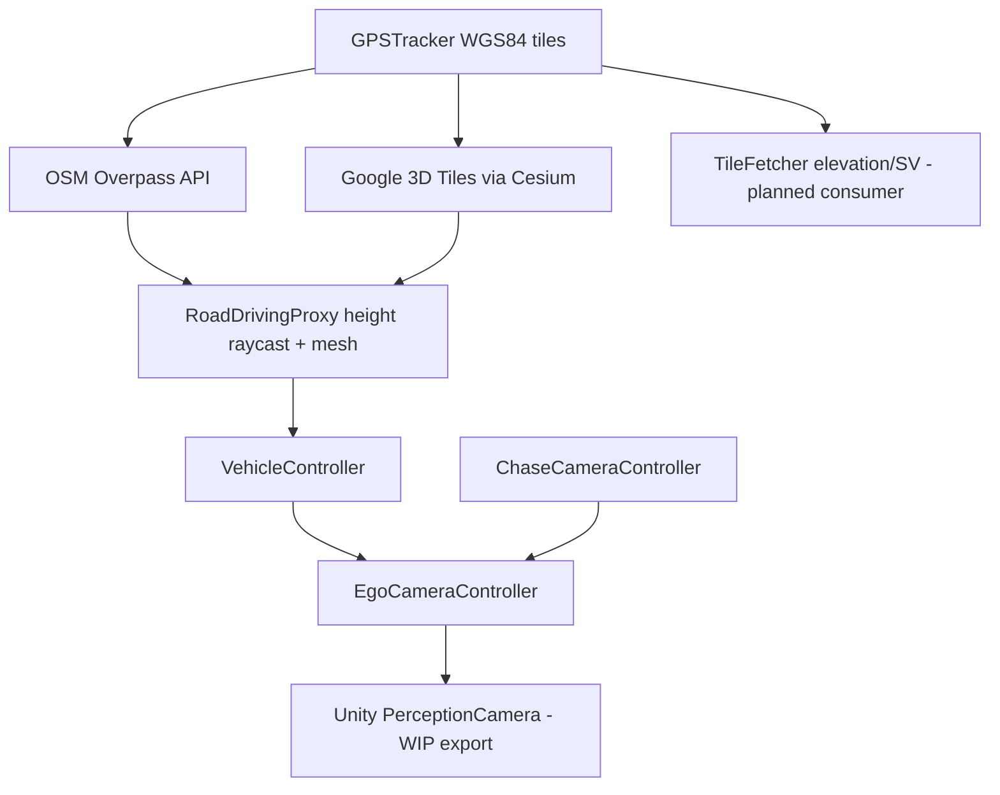
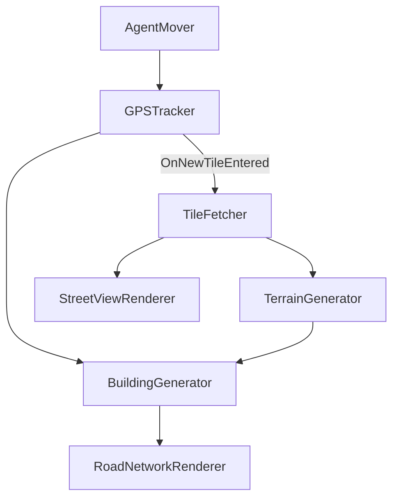

# Geospatial Synthetic Data Generation

Portfolio project demonstrating **geospatial data ingestion, tiling, and transformation** into simulation-ready 3D environments. Two complementary pipelines show how raw map and imagery sources can be preprocessed at runtime and converted into structured geometry anchored to real-world coordinates.

1. **Procedural OSM Pipeline** — ingests elevation rasters, street-level imagery, and OSM vector data; tiles and transforms them into terrain, buildings, and road meshes.
2. **Cesium Photogrammetry Pipeline** — streams photorealistic 3D Tiles, fuses OSM road vectors onto terrain via height raycasting, and captures structured camera output for synthetic datasets.

> **Scripts-only repo:** This GitHub repository contains **Unity C# scripts + demo media only**. The full Unity project (scenes, HDRP assets, Cesium tileset wiring, Perception labelers) stays in local Unity Version Control / Plastic SCM. That is intentional — Unity projects are large, scene files serialize Inspector values (including API keys), and recruiters care most about pipeline logic.

**Full project (local):** `RealSceneGen` in Unity 6 + Plastic SCM  
**Portfolio repo (public):** https://github.com/Pruthvi-Radadiya/Geospatial-Synthetic-Data-Generation

---

## Demo

| Chase camera over Cesium photogrammetry | Ego (sensor) camera viewpoint |
|---|---|
|  |  |

Default Cesium location: Karlsruhe region (~48.89°N, 8.69°E). Drive with **WASD**; toggle chase / ego with **C**.

---

## Scripts-only vs full Unity project

| Upload to GitHub | Keep local (Plastic SCM / Unity) |
|---|---|
| `.cs` pipeline scripts | `Library/`, `Temp/`, `Logs/` |
| `README.md`, `docs/demo/` screenshots | HDRP render pipeline assets |
| Architecture diagrams | `OutdoorsScene.unity` (contains Inspector-serialized API keys) |
| `.gitignore` | Cesium ion / Google API keys (set in Inspector only) |
| | Unity Perception labeler configs, Solo dataset output |

**API keys:** Setting a key in the Unity Inspector **does** write it into `.unity` scene YAML. That is why keys belong in your local project only, not in a public full-project upload. This scripts-only repo uses placeholders (`YOUR_API_KEY_HERE`, `YOUR_GOOGLE_API_KEY`) in code comments and setup notes.

---

## Overview

Geospatial ML platforms need reliable preprocessing: ingest heterogeneous sources, tile them consistently, transform coordinates correctly, and produce downstream-ready outputs.

This project prototypes that in simulation. The agent's position is tracked in **WGS-84 GPS**, and the environment is either **reconstructed from APIs and OSM vector data** (procedural pipeline) or **streamed from photogrammetric 3D Tiles with OSM road fusion** (Cesium pipeline). Both use **event-driven, tile-based processing** with queueing, stale-response guards, and retry logic.

| Pipeline | Default coordinates | Location |
|---|---|---|
| Procedural OSM | 48.8584, 2.2945 | Paris (Eiffel Tower area) |
| Cesium Photogrammetry | 48.893697, 8.694218 | Karlsruhe region, Germany |

---

## Two Approaches Compared

| | Procedural OSM Pipeline | Cesium Photogrammetry Pipeline |
|---|---|---|
| **Data source** | Google Elevation + Street View, Overpass/OSM | Google Photorealistic 3D Tiles + Overpass/OSM roads |
| **World generation** | Runtime mesh from API responses | Streamed photogrammetry + vector-to-surface fusion |
| **Visual fidelity** | Stylized procedural geometry | Photorealistic real-world geometry |
| **Geospatial math** | Manual WGS-84 / Haversine in `GPSTracker` | `CesiumGlobeAnchor` + ellipsoid raycast height sampling |
| **Agent control** | `AgentMover` (keyboard, terrain-snapped) | `VehicleController` (rigidbody, proxy/Cesium fallback) |
| **Output products** | Terrain, buildings, road meshes, facade textures | Drivable road proxy deck, perception camera frames |
| **Scripts in this repo** | 7 | 6 |

---

## Architecture

### Cesium Photogrammetry Pipeline (current focus)



**Key behaviors**

- `RoadDrivingProxy` fetches OSM highways, subdivides segments on grade, raycasts onto Cesium colliders for height, and builds an invisible drivable deck (optional green debug mesh).
- `VehicleController` spawns on proxy when ready; falls back to Cesium photogrammetry colliders during tile streaming.
- `EgoCameraController` renders to HDRP `RenderTexture` for background capture; reflection bypass prevents Perception blit from conflicting with chase camera.
- `ChaseCameraController` toggles chase ↔ ego view (`C` key in full project).

### Procedural OSM Pipeline



See script tables below for full event chain.

---

## What's working vs planned

| Component | Status |
|-----------|--------|
| Cesium 3D Tiles streaming + WGS-84 anchoring | Working |
| OSM road fetch + `RoadDrivingProxy` height fusion | Working — WIP refinement |
| Vehicle driving + chase / ego cameras | Working |
| Unity Perception wiring (depth, segmentation, bbox labelers) | Wired in local project — export WIP |
| LiDAR simulation | **Not in this repo** (professional experience at understand.ai) |
| Python `validate.py` CLI | Planned |
| `TileFetcher` elevation / Street View (Cesium pipeline) | Fetch only — no consumer yet |

---

## Perception & sensor data — what to show in portfolio

| Asset | Show on GitHub? | Notes |
|-------|-----------------|-------|
| Chase / ego camera screenshots | **Yes** | Already in `docs/demo/` — proves photorealistic streaming |
| Perception visualization (depth, segmentation overlay) | **Yes, 1–2 images** | Only if captured from your real local setup; label as "WIP capture pipeline" |
| Exported Solo dataset / frame sequences | **No** (today) | Large files; enable PerceptionCamera locally first |
| LiDAR point clouds | **No** | Not implemented here; do not add fake outputs |
| Full multi-sensor dataset | **No** | Overselling hurts credibility for data-plane roles |

**Recommendation:** Add 1–2 Perception HUD screenshots (depth or segmentation) to `docs/demo/` if you enable `PerceptionCamera` locally and capture during Play mode. Skip LiDAR in this repo for today's application — your LiDAR credibility is on the CV from understand.ai.

---

## Script Reference

### `Cesium_Photogrammetry_Pipeline/` (6 scripts)

| Script | Responsibility |
|---|---|
| `GPSTracker.cs` | Cesium-backed GPS tracker; fires `OnNewTileEntered` every 50 m |
| `RoadDrivingProxy.cs` | OSM ingest → Cesium height raycast → drivable proxy mesh + guard rails |
| `VehicleController.cs` | Rigidbody vehicle, spawn on proxy, Cesium fallback, fall recovery |
| `EgoCameraController.cs` | Perception sensor camera; HDRP RT capture; Perception blit bypass |
| `ChaseCameraController.cs` | Chase / ego camera toggle for demo and capture |
| `TileFetcher.cs` | Elevation grid + Street View fetch (events fired; consumer planned) |

### `Procedural_OSM_Pipeline/` (7 scripts)

| Script | Responsibility |
|---|---|
| `GPSTracker.cs` | Haversine WGS-84 tracking; `GpsToUnity()` helper |
| `TileFetcher.cs` | Google Elevation + Street View API hub with fetch queue |
| `TerrainGenerator.cs` | Streaming terrain mesh from elevation grids |
| `BuildingGenerator.cs` | OSM building footprints → extruded meshes + Street View facades |
| `RoadNetworkRenderer.cs` | OSM highways → asphalt strips snapped to terrain |
| `StreetViewRenderer.cs` | Hidden 360° photo ring for facade texturing |
| `AgentMover.cs` | WASD movement with terrain raycast snapping |

---

## Setup Notes

Developed in **Unity 6** (6000.3.7f1) with **HDRP** and **Cesium for Unity**.

### Required packages (full local project)

| Package | Used by |
|---|---|
| `com.unity.render-pipelines.high-definition` | Both pipelines |
| `com.unity.inputsystem` | `AgentMover`, `VehicleController` |
| `com.unity.perception` | `EgoCameraController` |
| Cesium for Unity | Cesium pipeline |

### API keys (local Inspector only — never commit scenes)

- **Google Map Tiles API** — Cesium photorealistic 3D Tiles URL
- **Google Elevation + Street View** — `TileFetcher.apiKey` (procedural + Cesium pipelines)
- **Overpass API** — public, no key

### Controls (full project)

- **WASD** — drive / move
- **C** — toggle chase ↔ ego camera

---

## Relevance to Data Plane Engineering

| Data Plane concern | How this project demonstrates it |
|---|---|
| Tiling & streaming | 50 m GPS tiles trigger fetch → transform → rebuild |
| Vector ingestion | Overpass/OSM for roads and buildings |
| Raster / 3D ingestion | Elevation grids, photogrammetric 3D Tiles |
| Coordinate systems | WGS-84, Cesium globe anchoring, ellipsoid raycasts |
| Pipeline resilience | Fetch queues, stale-response discard, Overpass retries |
| 3D-ready outputs | Road proxy meshes, building extrusions, perception frames |

Production Python/GDAL/FastAPI/PostgreSQL experience is from understand.ai (ETL, validation, MongoDB) — see CV.

---

## Repository Structure

```
Geospatial-Synthetic-Data-Generation/
├── README.md
├── .gitignore
├── docs/demo/               # Screenshots (no API keys, no datasets)
├── Procedural_OSM_Pipeline/ # 7 scripts
└── Cesium_Photogrammetry_Pipeline/  # 6 scripts
```

---

## What Is Not Included

- Full Unity project, scenes, materials, prefabs
- API keys (configure in local Inspector only)
- Unity Perception dataset exports or LiDAR simulation
- `Library/`, `Temp/`, HDRP pipeline assets

---

## Author

**Pruthvi Radadiya** — Software Engineer (Perception & Data Pipelines)

- GitHub: [@Pruthvi-Radadiya](https://github.com/Pruthvi-Radadiya)
- LinkedIn: [pruthvi-radadiya](https://www.linkedin.com/in/pruthvi-radadiya)
- Portfolio repo: [Geospatial-Synthetic-Data-Generation](https://github.com/Pruthvi-Radadiya/Geospatial-Synthetic-Data-Generation)
