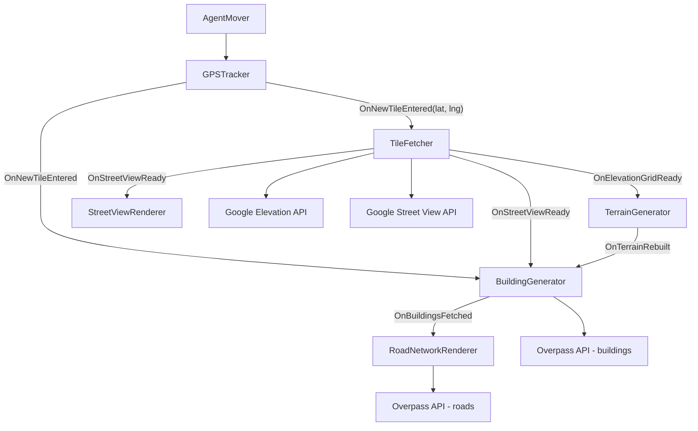
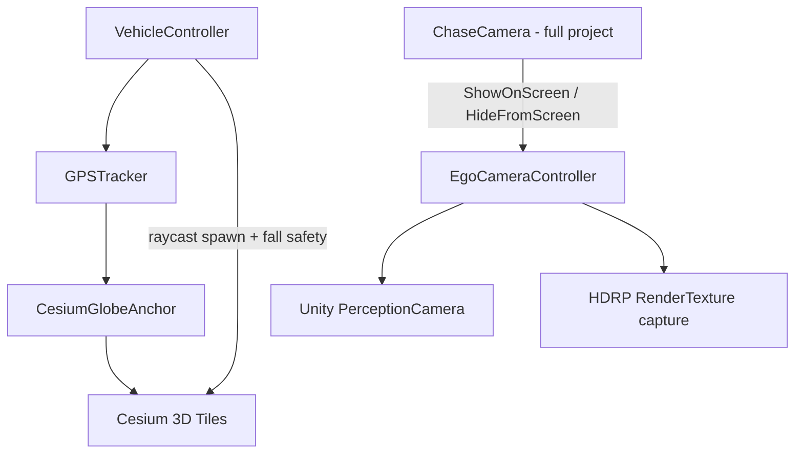

# Geospatial Synthetic Data Generation

Unity HDRP project for generating **synthetic driving and perception datasets** anchored to real-world GPS coordinates. This repository contains the core C# scripts from two complementary pipelines developed in parallel:

1. **Procedural OSM Pipeline** — builds a drivable world from Google APIs and OpenStreetMap data at runtime.
2. **Cesium Photogrammetry Pipeline** — drives through photorealistic Cesium 3D Tiles and captures labeled frames with Unity Perception.

> **Note:** This is a **scripts-only portfolio repo**. The full Unity project (scenes, HDRP assets, Cesium configuration) is intentionally excluded. Scripts are organized by pipeline so each approach can be reviewed independently.

---

## Overview

Autonomous driving and computer-vision models need large volumes of labeled sensor data. Photorealistic simulators are expensive to author by hand, and real-world collection is slow and geographically limited.

This project explores **geospatially anchored synthetic data generation**: the agent's position is tracked in real GPS coordinates, and the surrounding environment is either **procedurally reconstructed** from map APIs or **streamed from satellite photogrammetry**. Both pipelines share the goal of producing perception-ready captures while the user drives through a location that exists on Earth.

**Default demo locations**

| Pipeline | Default coordinates | Location |
|---|---|---|
| Procedural OSM | 48.8584, 2.2945 | Paris (Eiffel Tower area) |
| Cesium Photogrammetry | 48.893697, 8.694218 | Germany (Karlsruhe region) |

---

## Two Approaches Compared

| | Procedural OSM Pipeline | Cesium Photogrammetry Pipeline |
|---|---|---|
| **Data source** | Google Elevation API, Google Street View API, Overpass/OSM | Cesium ion 3D Tiles (photogrammetry mesh) |
| **World generation** | Runtime mesh building from API responses | Pre-authored globe tiles streamed by Cesium |
| **Visual fidelity** | Stylized procedural geometry; Street View textures on facades | Photorealistic real-world geometry |
| **Geospatial math** | Manual WGS-84 / Haversine conversion in `GPSTracker` | `CesiumGlobeAnchor` handles Earth curvature |
| **Agent control** | `AgentMover` (keyboard, terrain-snapped) | `VehicleController` (rigidbody car physics, globe-aware) |
| **Dataset capture** | Street View ring + procedural scene (foundation for labeling) | `EgoCameraController` + Unity Perception (HDRP RenderTexture) |
| **External APIs** | Google Maps (key required), Overpass (public) | Cesium ion token (in full project, not in this repo) |
| **Scripts in this repo** | 7 | 3 |

### When to use which

- **Procedural OSM** scales to any GPS coordinate where Google and OSM have coverage, with full control over mesh generation and a lightweight dependency footprint (HTTP + JSON parsing only).
- **Cesium Photogrammetry** prioritizes visual realism for perception datasets where ground-truth alignment to real-world geometry matters, at the cost of Cesium licensing/streaming infrastructure.

---

## Architecture

### Procedural OSM Pipeline

Tile-based streaming: every 50 m the agent moves, `GPSTracker` fires `OnNewTileEntered`, which triggers a coordinated fetch-and-rebuild cycle.



**Event chain per tile**

1. `GPSTracker` detects 50 m movement → fires `OnNewTileEntered`.
2. `TileFetcher` queues the tile, fetches elevation grid + 8 Street View headings (0°–315°).
3. `TerrainGenerator` rebuilds a streaming mesh from the elevation grid and snaps the agent.
4. `BuildingGenerator` queries OSM buildings, waits for terrain sync, extrudes footprints, textures facades from the nearest Street View heading.
5. `RoadNetworkRenderer` fetches OSM highways after buildings complete, builds asphalt strips snapped to terrain.
6. `StreetViewRenderer` builds a hidden 360° photo ring (texture source for buildings).

**Resilience patterns**

- Fetch queue in `TileFetcher` prevents overlapping API calls when the agent moves quickly.
- Stale-response guards in `BuildingGenerator` and `RoadNetworkRenderer` discard results if the agent has already moved to a new tile.
- Retry logic (3 attempts) on Overpass API failures.

### Cesium Photogrammetry Pipeline

Globe-anchored driving with a dedicated perception capture camera.



**Key behaviors**

- `GPSTracker` reads lat/lng/height from `CesiumGlobeAnchor` instead of manual Haversine math.
- `VehicleController` stays kinematic until a downward raycast hits loaded Cesium colliders, then enables physics. Includes fall-through recovery during LOD tile swaps.
- `EgoCameraController` renders to an HDRP `RenderTexture` for background dataset capture while a cloned screen-view camera can be toggled on/off. Uses reflection to bypass Unity Perception's hardcoded screen blit so the chase camera and capture camera do not conflict.

---

## Script Reference

### `Procedural_OSM_Pipeline/` (7 scripts)

| Script | Responsibility |
|---|---|
| `GPSTracker.cs` | Tracks agent movement in WGS-84 coordinates using Haversine math. Fires `OnNewTileEntered` every `tileSizeMetres` (default 50 m). Provides `GpsToUnity()` for other scripts. |
| `TileFetcher.cs` | Central API hub. Queues tile fetches; calls Google Elevation (batched grid) and Street View (8 headings). Detects grey "no imagery" placeholders. Fires `OnElevationGridReady`, `OnStreetViewReady`. |
| `TerrainGenerator.cs` | Builds a streaming `Mesh` + `MeshCollider` from elevation grids. Positions terrain at the tile's GPS location. Snaps agent after physics update. |
| `BuildingGenerator.cs` | Fetches OSM building footprints via Overpass. Extrudes walls/roof meshes, applies procedural palette + Street View facade textures. Skips colliders if agent is inside bounds. |
| `RoadNetworkRenderer.cs` | Fetches drivable OSM highways. Builds road strips with type-dependent widths, snapped to terrain height. Chains off `BuildingGenerator.OnBuildingsFetched`. |
| `StreetViewRenderer.cs` | Listens to `OnStreetViewReady`, builds a ring of photo panels (hidden; used as texture pipeline). |
| `AgentMover.cs` | WASD/arrow keyboard movement with terrain raycast snapping. Drives the procedural pipeline agent. |

### `Cesium_Photogrammetry_Pipeline/` (3 scripts)

| Script | Responsibility |
|---|---|
| `GPSTracker.cs` | Cesium-backed GPS tracker. Sets initial position on `CesiumGlobeAnchor`, reads live coordinates each frame, fires `OnNewTileEntered` on 50 m movement. |
| `VehicleController.cs` | Rigidbody vehicle with procedural car mesh, wheel animation, globe-aware steering (yaw rate from bicycle model), slope alignment, spawn snapping, and fall-through safety. |
| `EgoCameraController.cs` | Perception sensor camera. HDRP RenderTexture capture, dynamic screen clone, reflection-based Perception blit bypass, integration with chase camera toggle. |

---

## Key Technical Highlights

**Geospatial**

- WGS-84 coordinate conversion with latitude-dependent longitude scaling (`cos(lat)` correction).
- Tile-based streaming architecture decoupled via C# events — no tight coupling between fetchers and renderers.

**API integration**

- Batched Google Elevation requests (up to 81 points per call) to stay within API limits.
- Custom JSON parsing without external dependencies (keeps the portfolio self-contained).
- Overpass QL queries for OSM buildings and highways with retry and stale-response handling.

**Procedural geometry**

- Runtime mesh generation for terrain, extruded building footprints (wall + roof sub-meshes), and road strips.
- Ground-height raycasting ensures buildings and roads conform to streamed elevation.
- Street View heading selection for facade texturing based on building centroid bearing.

**Physics and perception**

- Globe-safe vehicle physics: steering projected onto ground normals, lateral grip simulation, kinematic spawn until tiles load.
- Unity Perception integration with HDRP-compatible capture path and custom render-pipeline hook to avoid display conflicts.

---

## Setup Notes

These scripts were developed in **Unity 6** (6000.3.7f1) with **HDRP 17.3.0**.

### Required packages (full Unity project)

| Package | Used by |
|---|---|
| `com.unity.render-pipelines.high-definition` | Both pipelines |
| `com.unity.inputsystem` | `AgentMover`, `VehicleController` |
| `com.unity.perception` | `EgoCameraController` |
| Cesium for Unity | Cesium pipeline (`CesiumGlobeAnchor`) |

### API keys

- **Google Maps Platform** — enable Elevation API and Street View Static API. Set `apiKey` on `TileFetcher` (placeholder: `YOUR_API_KEY_HERE`). Never commit real keys.
- **Overpass API** — public endpoint (`overpass-api.de`); no key required. Respect rate limits.
- **Cesium ion** — configured in the full Unity project, not in these standalone scripts.

### Scene wiring (high level)

**Procedural OSM**

1. Add `GPSTracker` + `AgentMover` to the agent GameObject.
2. Add `TileFetcher`, `TerrainGenerator`, `BuildingGenerator`, `RoadNetworkRenderer`, `StreetViewRenderer` to scene managers.
3. Assign `agentTransform` on `TerrainGenerator`.
4. Set initial GPS in `GPSTracker` Inspector.

**Cesium Photogrammetry**

1. Set up Cesium georeference + 3D Tileset in the full project.
2. Add `CesiumGlobeAnchor` + `GPSTracker` + `VehicleController` to the vehicle.
3. Add `PerceptionCamera` + `EgoCameraController` to the ego sensor camera.
4. Wire chase camera `ShowOnScreen` / `HideFromScreen` calls (see full project).

### Controls

- **WASD / Arrow keys** — move agent (procedural) or drive vehicle (Cesium).

---

## Demo / Screenshots

<!-- Add your demo media here, for example:


[YouTube walkthrough](https://youtube.com/...)
-->

_Demo GIFs and screenshots can be added to a `docs/` folder and linked above._

---

## Repository Structure

```
Geospatial-Synthetic-Data-Generation/
├── README.md
├── .gitignore
├── Procedural_OSM_Pipeline/
│   ├── GPSTracker.cs
│   ├── TileFetcher.cs
│   ├── TerrainGenerator.cs
│   ├── BuildingGenerator.cs
│   ├── RoadNetworkRenderer.cs
│   ├── StreetViewRenderer.cs
│   └── AgentMover.cs
└── Cesium_Photogrammetry_Pipeline/
    ├── GPSTracker.cs
    ├── VehicleController.cs
    └── EgoCameraController.cs
```

---

## What Is Not Included

- Full Unity project, scenes, materials, and prefabs
- Cesium ion configuration and tileset assets
- Unity Perception dataset configuration (labelers, serializers)
- API keys or tokens

---

## Author

**Pruthvi Radadiya**

- GitHub: [@Pruthvi-Radadiya](https://github.com/Pruthvi-Radadiya)

---

## Script Review Notes

This section documents the portfolio review performed when assembling this repo.

### Gaps addressed

- `AgentMover.cs` and `StreetViewRenderer.cs` were present in the Unity project but missing from the portfolio — both are now included in `Procedural_OSM_Pipeline/`.

### Minor cross-pipeline reference

- `BuildingGenerator.cs` references `VehicleController` only for an agent-inside-building collider check. In the procedural pipeline, the agent uses `AgentMover`; the `FindObjectOfType<VehicleController>()` call safely returns null and is a no-op.

### Suggested follow-ups (optional)

- Add a `docs/` folder with demo GIFs for recruiters.
- Add per-pipeline README snippets if the repo grows beyond 10 scripts.
- Rotate any GitHub personal access token that was previously embedded in the local git remote URL.
