# Geospatial Synthetic Data Generation

An independent project exploring how **real-world geospatial data** can be ingested, tiled, and transformed into **simulation-ready 3D environments** in Unity — with a longer-term goal of generating and validating **multi-sensor synthetic datasets** for autonomous driving research.

Two complementary pipelines are implemented as separate development branches:

1. **Procedural OSM Pipeline** - builds terrain, buildings, and roads at runtime from Google Elevation, Street View, and OpenStreetMap vector data.
2. **Cesium Photogrammetry Pipeline** - streams photorealistic 3D Tiles, fuses OSM road geometry onto terrain via height raycasting, and supports ego-camera capture for synthetic sensor output.

This repository contains the **C# pipeline scripts** and **demo media**. The full Unity project (scenes, HDRP assets, Cesium configuration, Perception labelers) is maintained locally in Unity Version Control (Plastic SCM) under `RealSceneGen`.

---

## Demo

### Cesium Photogrammetry Pipeline

Branch: `/main/using-cesium-map` · Location: Karlsruhe, Germany (~48.89°N, 8.69°E)

| Overview |
|---|
| 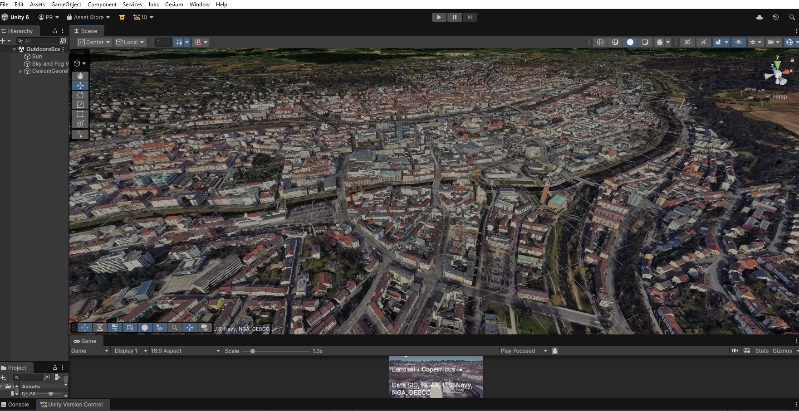 |

| Chase camera | Ego camera |
|---|---|
| 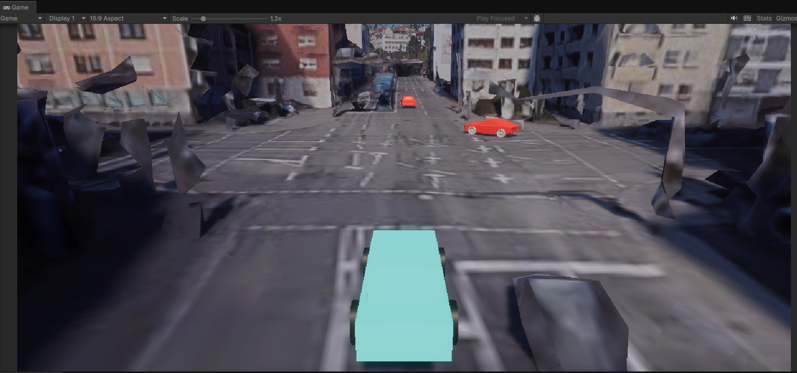 | 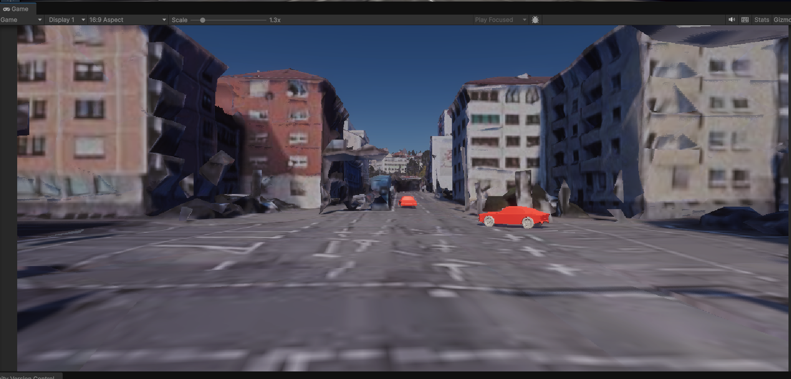 |

**RoadDrivingProxy** *(in progress)* — OSM road vectors fused onto Cesium terrain via height raycasting. Driving physics and mesh refinement are still being tuned.

| Road proxy debug mesh *(in progress)* |
|---|
| 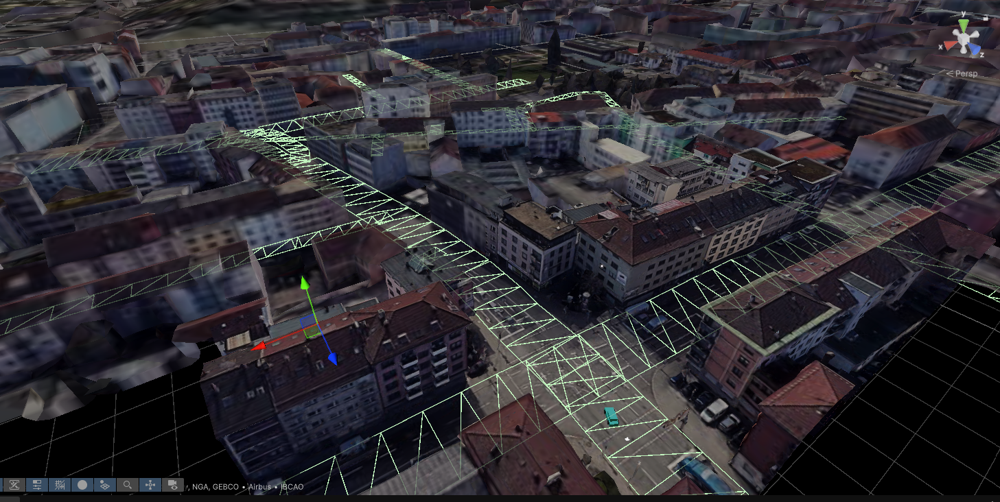 |

|Driving recording |
|---|
| <video src="docs/demo/cesium-driving.mp4" controls="controls" style="max-width: 100%;"></video> |

Controls: **WASD** to drive · **C** to toggle chase / ego camera

### Procedural OSM Pipeline

Branch: `/main` · Location: Paris, France (~48.86°N, 2.29°E)

| Overview |   |
|---|---|
| 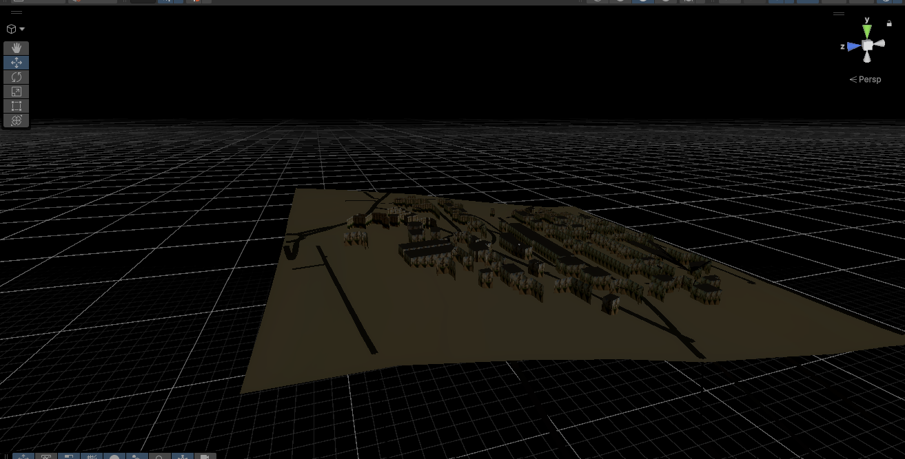 | 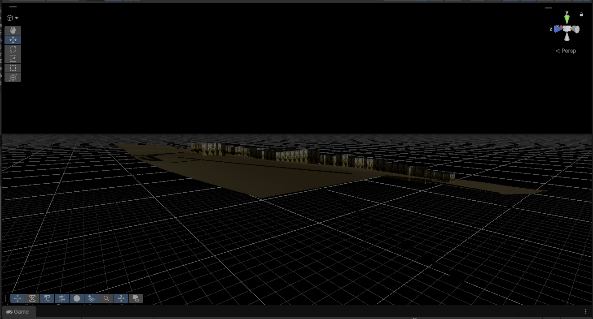 |

| Roads and terrain |
|---|
|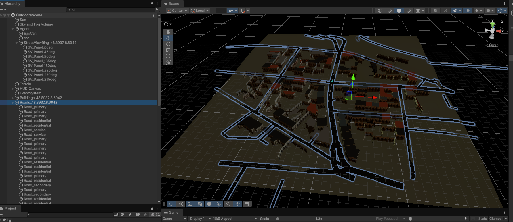 |

| buildings |
|---|
| 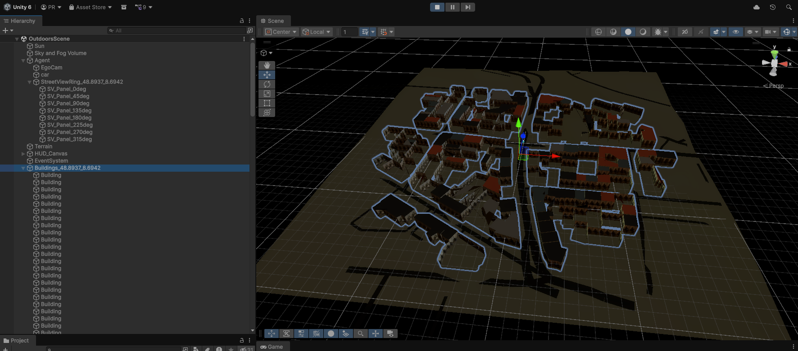 |

| Driving recording |
|---|
| <video src="docs/demo/procedural-walkthrough.mp4" controls="controls" style="max-width: 100%;"></video> |

Terrain, buildings, and roads are generated at runtime from elevation grids, Street View imagery, and Overpass OSM queries. Controls: **WASD** to move the agent.


### Sensor capture — Unity Perception (Solo)

Ego-camera recordings from the Cesium branch using **Unity Perception** → Solo dataset format. Example local output: `solo_2/sequence.0` (73 frames, 1920×1080).

| RGB | Semantic segmentation |
|---|---|
| 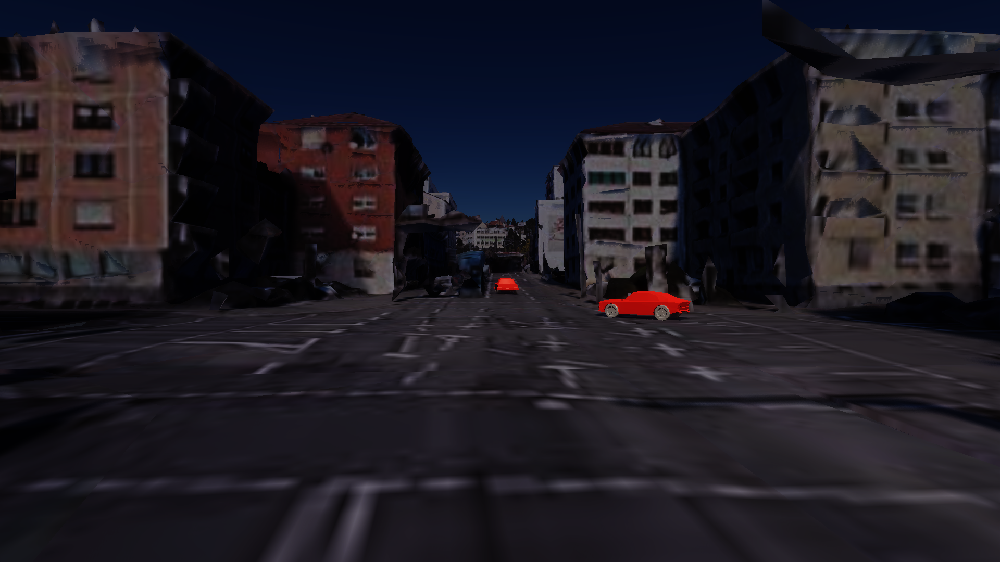 |  |

**Currently exported per frame**

| Output | Format | Status |
|--------|--------|--------|
| RGB camera | PNG (1920×1080) | Recording |
| Depth | EXR (32-bit, metres) | Recording |
| Semantic segmentation | PNG | Recording — label config: `car` only so far |
| 3D bounding boxes | JSON (Solo) | Labeler active |
| Frame metadata | `stepN.frame_data.json` | Camera pose, timestamp, annotation refs, see example file :  [docs/demo/step700.frame_data.json](docs/demo/step700.frame_data.json)|

---

## Repository layout

| Plastic SCM branch (local) | Pipeline | Scripts in this repo |
|---|---|---|
| `/main` | Procedural OSM | `Procedural_OSM_Pipeline/` |
| `/main/using-cesium-map` | Cesium photogrammetry | `Cesium_Photogrammetry_Pipeline/` |

```
Geospatial-Synthetic-Data-Generation/
├── README.md
├── docs/demo/                        # Screenshots and recordings
├── Procedural_OSM_Pipeline/          # 7 scripts
└── Cesium_Photogrammetry_Pipeline/   # 6 scripts
```

---

## Overview

Both pipelines track agent position in **WGS-84** and rebuild the surrounding world in **50 m tiles** as the agent moves. Processing is **event-driven**: fetch stages emit results that downstream mesh builders consume, with queueing, stale-response guards, and retry logic where APIs can lag or fail.

| Pipeline | Default coordinates | Location |
|---|---|---|
| Procedural OSM | 48.8584, 2.2945 | Paris |
| Cesium Photogrammetry | 48.893697, 8.694218 | Karlsruhe region |

---

## Two approaches compared

| | Procedural OSM | Cesium Photogrammetry |
|---|---|---|
| **Data sources** | Google Elevation, Street View, Overpass/OSM | Google Photorealistic 3D Tiles, Overpass/OSM roads |
| **World generation** | Runtime meshes from API responses | Streamed photogrammetry + vector-to-surface fusion |
| **Visual style** | Procedural / stylized geometry | Photorealistic real-world geometry |
| **Coordinates** | Manual WGS-84 / Haversine (`GPSTracker`) | `CesiumGlobeAnchor` + ellipsoid raycasts |
| **Agent** | `AgentMover` - keyboard, terrain-snapped | `VehicleController` - rigidbody, proxy/Cesium fallback |
| **Outputs** | Terrain, buildings, roads, facade textures | Road proxy deck, camera capture frames |

---

## Architecture

### Cesium Photogrammetry Pipeline

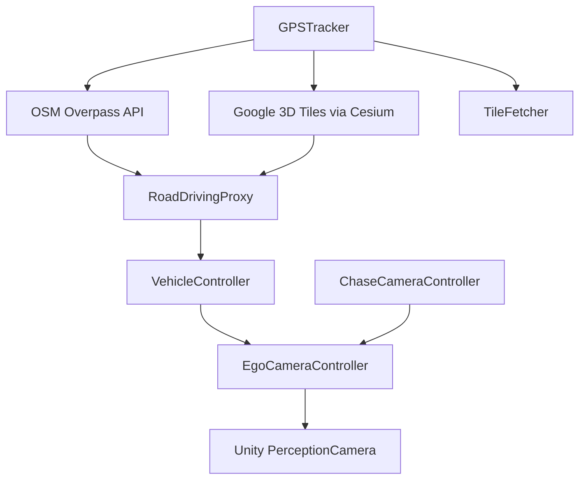

- **`RoadDrivingProxy`** - fetches OSM highways, subdivides on grade, raycasts heights onto Cesium colliders, builds a drivable proxy mesh (optional debug overlay).
- **`VehicleController`** - physics driving with spawn-on-proxy and Cesium collider fallback during tile streaming.
- **`EgoCameraController`** - HDRP `RenderTexture` capture path with Unity Perception integration; chase/ego toggle via **`ChaseCameraController`**.

### Procedural OSM Pipeline

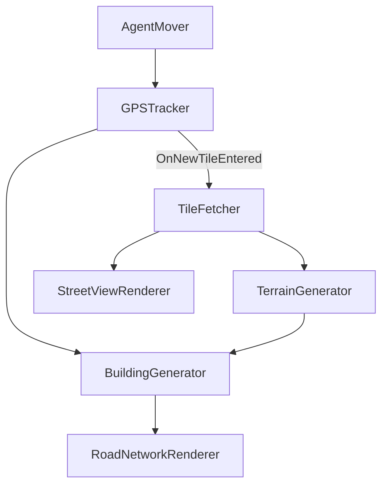

Each new tile triggers elevation and Street View fetch, terrain rebuild, OSM building extrusion, and road mesh generation in sequence.

---

## Roadmap

Longer-term direction for the full `RealSceneGen` project. Items marked **in progress** are partially implemented; **planned** will follow once the core environment and capture paths are stable.

### Environment & geometry

| Item | Status | Notes |
|------|--------|-------|
| Procedural OSM pipeline (terrain, buildings, roads) | Done | `/main` branch |
| Cesium photogrammetry streaming | Done | `/main/using-cesium-map` |
| `RoadDrivingProxy` — vector-to-surface road fusion | **In progress** | OSM + Cesium height raycast; mesh refinement and driving stability ongoing |
| Cesium branch `TileFetcher` consumer | Planned | Elevation / Street View fetch exists; not wired to scene yet |
| Traffic vehicles on OSM road graph | Planned | Waypoint-following AI |
| Pedestrians (NavMesh) | Planned | |
| Road signs, trees, street furniture from OSM | Planned | |

### Sensor simulation

| Item | Status | Notes |
|------|--------|-------|
| Ego camera + chase camera | Done | HDRP render path |
| Unity Perception Solo export (RGB, depth, segmentation) | **In progress** | 73-frame test capture working; bbox needs labeled objects |
| GNSS from `GPSTracker` / `CesiumGlobeAnchor` | Done | WGS-84 position stream |
| IMU from rigidbody state | Planned | Acceleration / angular velocity |
| LiDAR (raycast point cloud) | Planned | |
| Radar (raycast velocity) | Planned | |

### Data export & tooling

| Item | Status | Notes |
|------|--------|-------|
| nuScenes-compatible exporter | Planned | JSON scene tokens, images, point clouds |
| KITTI export (secondary) | Planned | |
| `validate.py` — export quality checks | Planned | Python CLI for format / temporal / geometric consistency |
| ML training loop (domain gap, detection models) | Planned | Optional later phase |
| ROS2 topic publishing | Planned | Optional |

### Project status (summary)

| Component | Status |
|-----------|--------|
| Procedural terrain, buildings, roads | Done |
| Cesium 3D Tiles + WGS-84 anchoring | Done |
| `RoadDrivingProxy` height fusion | **In progress** |
| Vehicle driving + chase / ego cameras | Done |
| Unity Perception dataset export | **In progress** | RGB + depth + segmentation recording; bbox labeling next |
| Multi-sensor suite (LiDAR, IMU, radar) | Planned |
| nuScenes / KITTI export | Planned |
| `validate.py` | Planned |

---

## Scripts

### `Cesium_Photogrammetry_Pipeline/`

| Script | Role |
|---|---|
| `GPSTracker.cs` | GPS tile events every 50 m via `CesiumGlobeAnchor` |
| `RoadDrivingProxy.cs` | OSM ingest → height raycast → drivable mesh |
| `VehicleController.cs` | Vehicle physics, spawn, fall recovery |
| `EgoCameraController.cs` | Ego sensor camera + Perception capture |
| `ChaseCameraController.cs` | Chase / ego camera toggle |
| `TileFetcher.cs` | Elevation and Street View API fetch |

### `Procedural_OSM_Pipeline/`

| Script | Role |
|---|---|
| `GPSTracker.cs` | WGS-84 tracking and `GpsToUnity()` conversion |
| `TileFetcher.cs` | Elevation grid + Street View fetch queue |
| `TerrainGenerator.cs` | Terrain mesh from elevation data |
| `BuildingGenerator.cs` | OSM footprints → extruded buildings + facades |
| `RoadNetworkRenderer.cs` | OSM highways → road meshes on terrain |
| `StreetViewRenderer.cs` | 360° Street View ring for texturing |
| `AgentMover.cs` | Keyboard movement with terrain snapping |

---

## Setup

Built with **Unity 6** (6000.3.7f1), **HDRP**, and **Cesium for Unity**.

| Package | Used by |
|---|---|
| `com.unity.render-pipelines.high-definition` | Both pipelines |
| `com.unity.inputsystem` | `AgentMover`, `VehicleController` |
| `com.unity.perception` | `EgoCameraController` |
| Cesium for Unity | Cesium pipeline |

**API keys** (Google Map Tiles, Elevation, Street View) are configured in the Unity Inspector on the local project only - not committed here.

**Overpass API** is public and requires no key.


---

## Design patterns

Patterns used across both pipelines:

- **Tile-based streaming** - 50 m movement triggers fetch → transform → rebuild
- **Event-driven stages** - decoupled fetchers and mesh builders via C# events
- **Coordinate handling** - WGS-84 anchoring, Haversine conversion, ellipsoid raycasts
- **Resilience** - fetch queues, stale-response discard, Overpass retry logic
- **Memory-conscious updates** - previous tile geometry destroyed before rebuild

---

## What is not in this repo

- Full Unity project, scenes, materials, and prefabs
- API keys or cloud tokens
- Exported Perception datasets or LiDAR simulation
- `Library/`, `Temp/`, and other Unity-generated folders

---

## Author

**Pruthvi Radadiya**

- GitHub: [@Pruthvi-Radadiya](https://github.com/Pruthvi-Radadiya)
- LinkedIn: [pruthvi-radadiya](https://www.linkedin.com/in/pruthvi-radadiya)
